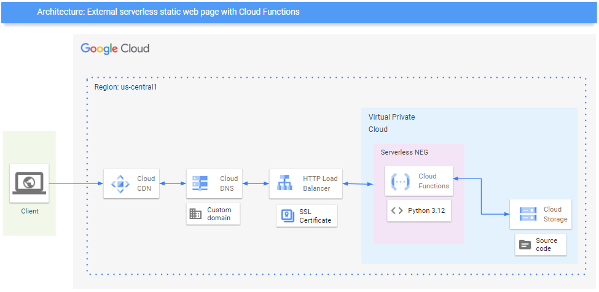

# Template - External serverless static web page

## Documentation
This template uses Cloud Functions to deploy the static web page.

## Summary
This blueprint is the bare minimum foundation for deploying an external serverless static web page



## Usage
1. Copy the `.template.tfvarsc` to `.auto.tfvars` and fill in the variables
2. Deploy the template
```bash
terraform apply
```
3. Go to the web page


